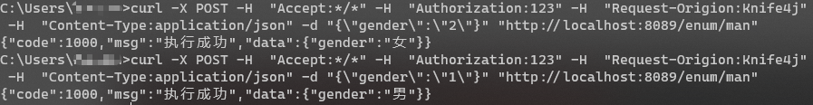
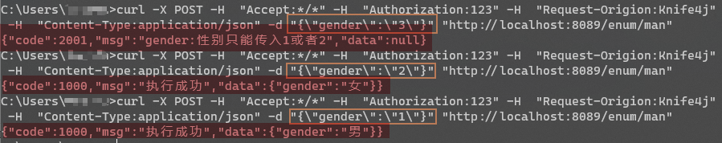

# 枚举类在SpringBoot中的使用


## 枚举类用作接口传参

`Controller`层的`man()`方法

```java
@RequestLog
@ApiOperation(value = "测试 Man Enum",notes = "可由 @JsonCreator 指定反序列化方法 , 前端传相应值 , 再由反序列方法反解析出相应枚举类")
@PostMapping("/man")
public R<Man> man(@Validated @RequestBody Man man) {
	return R.ok(man);
}
```

Java Bean 对象`Man`

```java
@Data
public class Man {
    @ApiModelProperty(value = "性别", example = "1")
    @CustomEnum(values = {1, 2}, message = "性别只能传入1或者2")
    private GenderEnum gender;
}
```

枚举类`GenderEnum`

```java
import com.baomidou.mybatisplus.annotation.EnumValue;
import com.fasterxml.jackson.annotation.JsonCreator;
import com.fasterxml.jackson.annotation.JsonValue;
import lombok.AllArgsConstructor;
import lombok.Getter;
import java.util.Arrays;

@AllArgsConstructor
@Getter
public enum GenderEnum implements IEnum {
    man(1,"男"), woman(2, "女"),unknow(3,"未知");
    
    @EnumValue
    Integer code;
    
    @JsonValue
    String desc;

    @JsonCreator // 仅@RequestBody下(json格式)也可做为接口枚举类参数反解析方法
    public static GenderEnum getEnumByCode(Integer code) {
        return Arrays.stream(GenderEnum.values()).filter(e -> e.code.equals(code)).findFirst().orElse(null);
    }

}
// 定义枚举接口 便于统一校验
public interface IEnum {
    Integer getCode();
}
```

使用curl命令访问接口如下




## 枚举类的参数校验

自定义注解 `CustomEnum` 用于校验枚举类

```java
@Documented
@Target({ METHOD, FIELD, ANNOTATION_TYPE })
@Retention(RetentionPolicy.RUNTIME)
@NotNull(message = "不能为空")
@Constraint(validatedBy = { CustomEnumConstraintValidator.class})
public @interface CustomEnum {
    /**
     * 提示消息
     */
    String message() default "传入的值不在范围内";

    /**
     * 分组
     * @return
     */
    Class<?>[] groups() default { };

    Class<? extends Payload>[] payload() default { };

    /**
     * 可以传入的值
     * @return
     */
    int[] values() default { };
}
```

校验器实现类 `CustomEnumConstraintValidator`

```java

/**
 * 校验器
 */
public class CustomEnumConstraintValidator implements ConstraintValidator<CustomEnum, IEnum> {
    /**
     * 存储枚举的值
     */
     Set<Integer> set = new HashSet<>();

    /**
     * 初始化方法
     *
     * @param customEnum 校验的注解
     */
    @Override
    public void initialize(CustomEnum customEnum) {
        for (int value : customEnum.values()) {
            set.add(value);
        }
    }

    /**
     * @param value   入参传的值
     * @param context
     * @return
     */
    @Override
    public boolean isValid(IEnum value, ConstraintValidatorContext context) {
        //判断是否包含这个值
        return set.contains(value.getCode());
    }
}
```

使用curl命令访问接口如下




## 总结

使用枚举类作为接口传参可以使代码更优雅，省去重复编写反解析枚举类型代码。使用自定义枚举校验则有些鸡肋，直接抛异常会更简洁.

```java
@JsonCreator
public static GenderEnum getEnumByCode(Integer code) {
    return Arrays.stream(GenderEnum.values())
            .filter(e -> e.code.equals(code))
            .findFirst()
            .orElseThrow(() -> new ApiException("未找到该code")
            );
}
```

